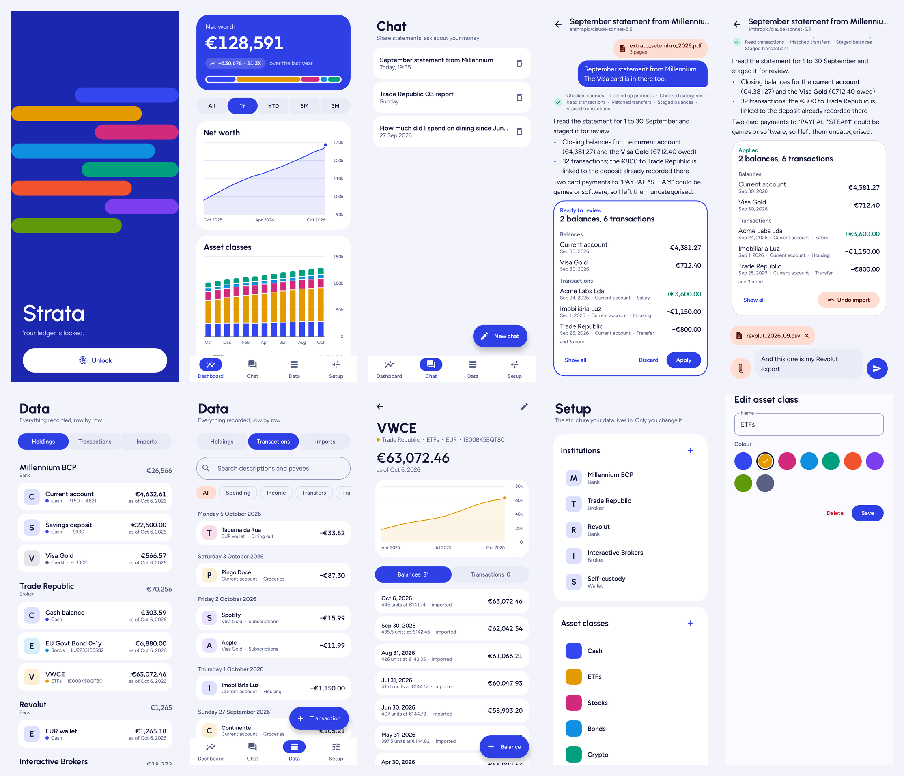
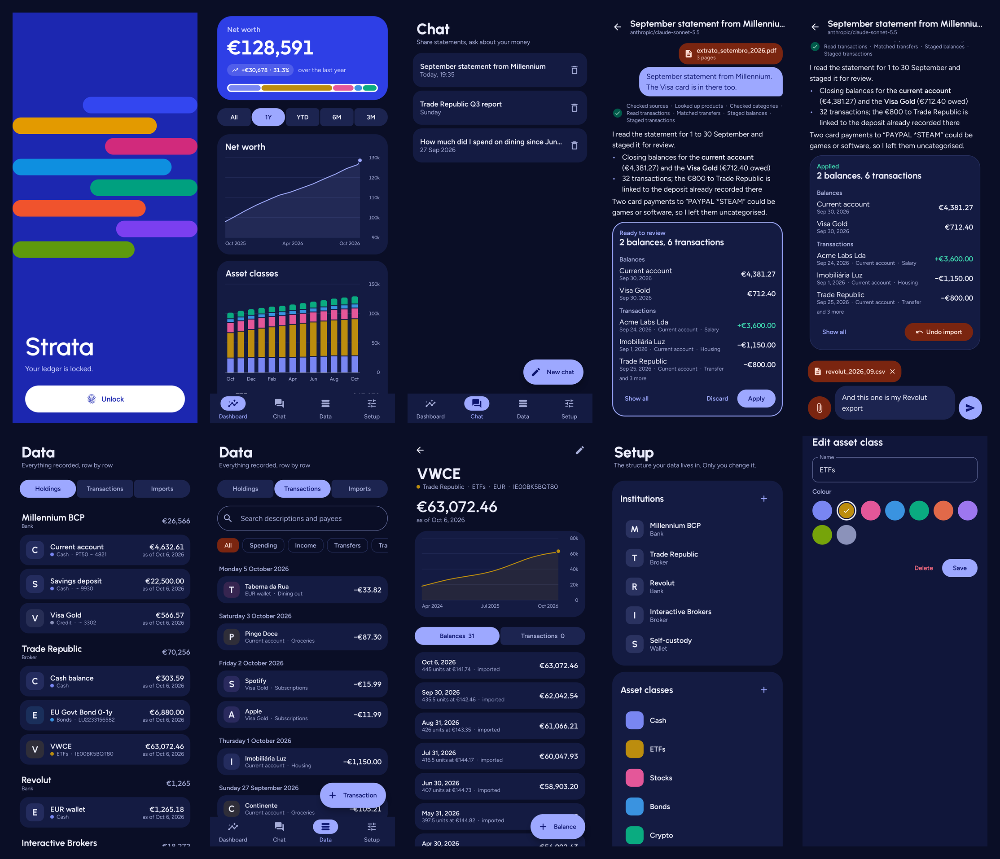

# Strata

A private personal-finance ledger for Android. Share statements from any bank, broker or wallet with an AI assistant; it drafts the entries, you review them, and a dashboard shows where your money is and where it goes. Everything lives in an encrypted database on the phone.




Every screen in both themes is in [`docs/screenshots`](docs/screenshots).

## What it does

- **Dashboard**: net worth, its change over the selected range, today's allocation as a strip of layers, a net-worth line, asset classes stacked per month or week (liabilities hang below zero), and monthly income against spending with the top categories. One range control drives every widget: All, 1Y, YTD, 6M, 3M.
- **Chat**: attach PDFs, CSVs or photos of statements. Text is extracted on the phone (PdfBox); scanned PDFs are sent as page images. The assistant uses typed tools to read the ledger and *stage* changes, which appear as a review card with Apply and Discard. Applied changes become an import you can undo later. Each turn has a collapsible trace: per round to the model, its duration, tokens and reasoning (when the model exposes it), and every tool call's arguments and result, with errors highlighted and a "Copy trace" button. While a turn runs you see live timers, and the send button becomes Stop, which cancels the in-flight request; anything already staged still lands on a review card. A single request gives up after 5 minutes.
- **Data**: holdings by institution, a searchable and filterable transaction list, the import log with undo, and a page per product with its balance history. Every row can be edited or added by hand.
- **Setup**: institutions, asset classes and spending categories, which only you can create. Also the OpenRouter key and model, and encrypted backup export and restore.

## Data model

```
Source (institution) ──┐
                       ├── Product (account / holding, one currency) ──┬── Snapshot (value on a date)
AssetClass ────────────┘                                               └── Transaction (signed flow)
SpendingCategory ───────────────────────────────────────────────────────────┘ (expense / income only)
Import ── tags every row the assistant wrote, so it can be undone as a unit
```

- **Snapshots are the truth for value**; transactions explain how money moved. Balances are never derived by summing transactions.
- Transaction kinds: expense, income, transfer, trade, dividend, interest, fee. Transfer and trade legs share a `transferGroup`, so moving money between your own accounts never counts as spending.
- Amounts are exact decimals in the product's own currency. Totals are converted to EUR at chart time with ECB reference rates (via [Frankfurter](https://frankfurter.dev)); requests contain only currency codes and dates.

## Privacy and security

- The Room database is encrypted with **SQLCipher**. Its random 256-bit passphrase is wrapped by an AES key in the Android Keystore (StrongBox on the Pixel's Titan M2), and that key only works right after a strong biometric or device-credential check.
- The OpenRouter key is stored inside the encrypted database.
- No cloud backup or device transfer of app data. `FLAG_SECURE` blocks screenshots and the recents thumbnail. The app asks again after a minute in the background.
- The only data that leaves the phone is what you send in Chat, and only to OpenRouter. "Private providers only" (on by default) restricts routing to providers that don't store or train on prompts.
- If the Keystore key is ever invalidated (for example, the screen lock is removed), the database cannot be opened. Export a backup from Setup now and then: it is AES-256-GCM encrypted with a passphrase you choose.

## Assistant tools

| Read | Stage (nothing is written until you tap Apply) |
|---|---|
| `list_sources`, `list_asset_classes`, `list_spending_categories` | `stage_product` (only under an existing source and asset class) |
| `list_products`, `get_snapshots`, `get_transactions` | `stage_snapshots`, `stage_transactions` |
| `find_transfer_candidates`, `get_portfolio`, `get_spending_summary` | `link_transfer`, `get_staged_changes`, `clear_staged_changes` |

Every argument is validated: ids must exist, dates use ISO format and can't be in the future, decimals use a dot, and categories must match the transaction kind. Likely duplicates are skipped and reported back to the model.

## Stack

Kotlin 2.4, Jetpack Compose with Material 3 Expressive (1.5 alpha), Room + SQLCipher, AndroidX Biometric, OkHttp, kotlinx.serialization, PdfBox-Android. Fonts are Urbanist (headings), Figtree (text) and Outfit (figures), bundled as static weights under the SIL Open Font License. Charts are drawn by hand on Compose `Canvas`.

## Build

```bash
./gradlew assembleRelease          # minified APK -> app/build/outputs/apk/release/
./gradlew testDebugUnitTest        # valuation, tool-flow and screenshot tests
./gradlew recordRoborazziDebug     # re-render docs/screenshots
```

CI builds the release APK on every push and attaches it to the run as `strata-apk`.

### Signing, so updates install over each other

Without a key, release builds are signed with the debug key, which differs between CI runners. Android then refuses to update in place, and uninstalling deletes the data. Create a key once and add it to the repository secrets:

```bash
keytool -genkeypair -v -keystore strata.jks -alias strata -keyalg RSA -keysize 4096 -validity 36500
base64 -w0 strata.jks   # -> secret STRATA_KEYSTORE_B64
```

Add the secrets `STRATA_KEYSTORE_B64`, `STRATA_KEYSTORE_PASSWORD` and, if they differ from the defaults, `STRATA_KEY_ALIAS` and `STRATA_KEY_PASSWORD`. Locally, export `STRATA_KEYSTORE=/path/to/strata.jks` and the same passwords.
